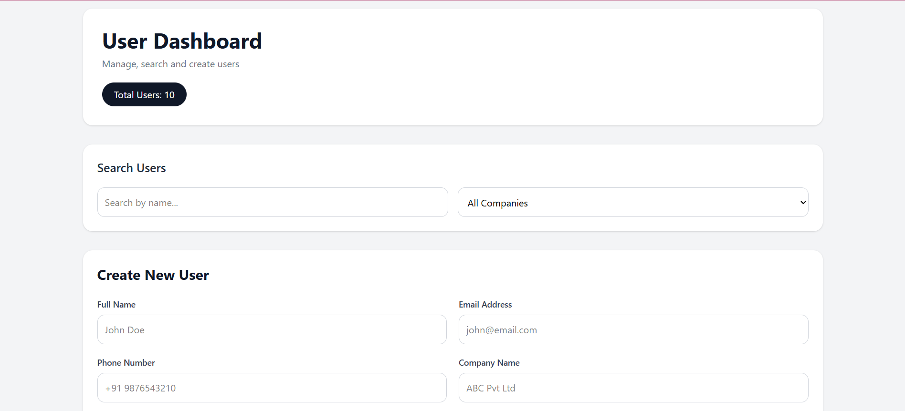
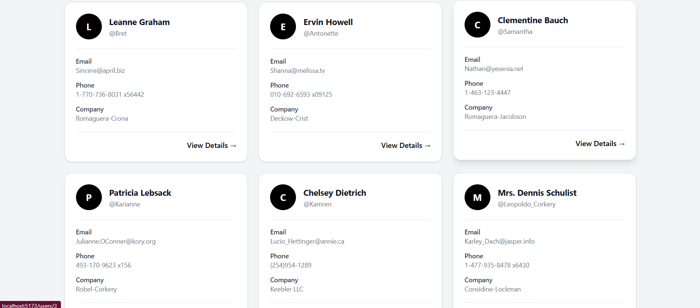
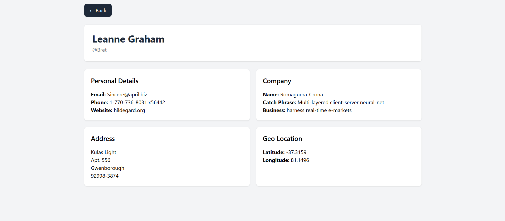

Setup Instructions

Clone the repository

git clone:  https://github.com/deepkanwarsingh/User_dashboard.git

Navigate to the project directory

cd <project-folder>

Install dependencies

npm install

Start the development server

npm run dev
Open the application
After the development server starts, open the URL displayed in the terminal (typically http://localhost:5173) in your browser.

If you want to include prerequisites, add this section above the setup instructions:

Prerequisites
Install the latest version of Node.js (which includes npm).

Verify the installation:

node -v
npm -v

